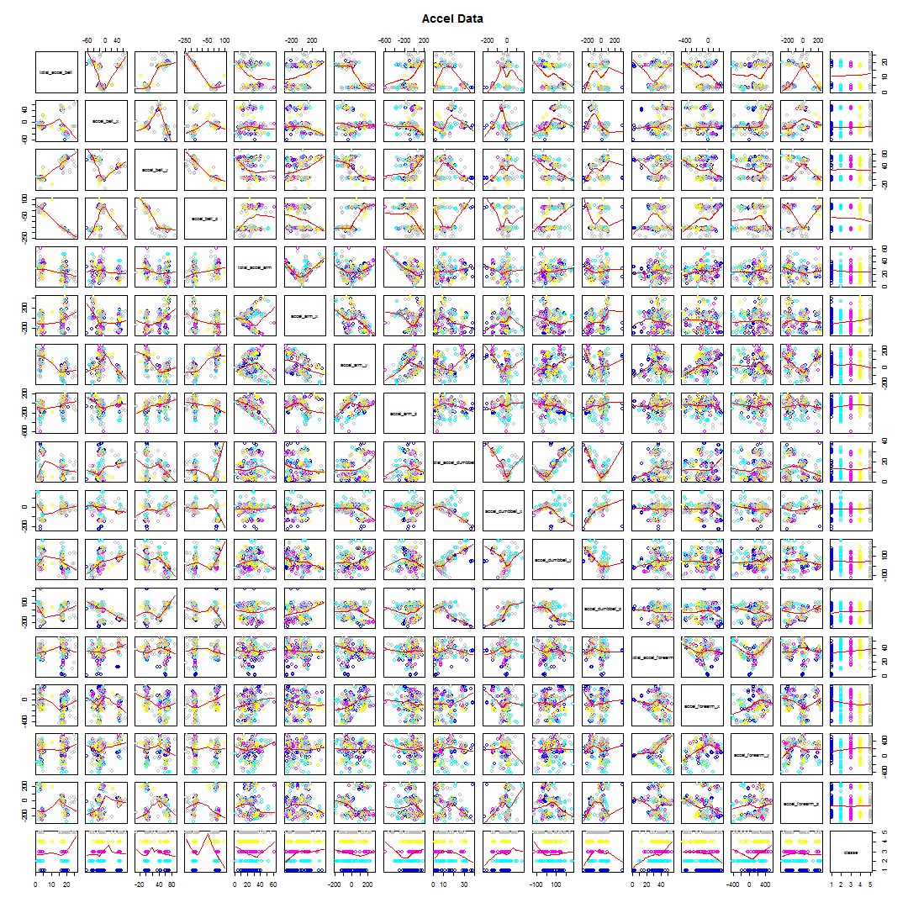

Course Project - Machine Learning
==========================================
by Philipp Paier (20.12.2014, 2014)

# Synopsis
The dataset under observation in this Course Project consists of 19622 observations and 160 variables. For this dataset 6 participants were asked to perform barbell lifts correctly and incorrectly in 5 different ways. Consequently each pbservation in the dataset corresponds to a performed exercise. During that time, the participants were monitored by various devices. More information can be found [here] (http://groupware.les.inf.puc-rio.br/har). The goal of this project is to use Machine Learning techniques to predict, if a certain exercise has been performed correctly or incorrectly.

# Data Processing
**Notes:**  
Code has been developed and tested with **R 3.1.1** on **Windows Vista**.


First the dataset is downloaded and loaded into the R workspace:

```r
require(caret);
require(kernlab);
require(e1071);
require(randomForest)

trainUrl  <- "https://d396qusza40orc.cloudfront.net/predmachlearn/pml-training.csv"
trainName <- "train.csv"
setInternet2(use = TRUE) # necessary under windows to download files when using knitr
download.file(trainUrl,destfile=trainName);
trainDataOrig <- read.csv(trainName);
```

To be able to learn from the data, it must first be cleaned. Therefore we remove variables, where data is missing. Also we decide to use only the data from accelerometers on the belt, forearm, arm and dumbbell as suggested by the course project description.


```r
vars <- names(trainDataOrig)[colSums(is.na(trainDataOrig))==0]
vars <- c(vars[grepl("accel",vars)],"classe")
trainData <- trainDataOrig[,vars]
```

This leaves us with 16 variables to predict the classe of an observation:

- **classe**: the variable to be predicted ranging from A to E (A:exercise was performed exactly as it should be, B to E: some incorrect manner how to perform the exercise)
- **total_accel_belt**: Total data of accelerometer on the belt
- **accel_belt_x**: X coord information given by the accelerometer on the belt
- **accel_belt_y**: Y coord information given by the accelerometer on the belt
- **accel_belt_z**: Z coord information given by the accelerometer on the belt
- **total_accel_arm**: Total data of accelerometer on the arm
- **accel_arm_x**: X coord information given by the accelerometer on the arm
- **accel_arm_y**: Y coord information given by the accelerometer on the arm
- **accel_arm_z**: Z coord information given by the accelerometer on the arm
- **total_accel_dumbbell**: Total data of accelerometer on the dumbbell
- **accel_dumbbell_x**: X coord information given by the accelerometer on the dumbbell
- **accel_dumbbell_y**: Y coord information given by the accelerometer on the dumbbell
- **accel_dumbbell_z**: Z coord information given by the accelerometer on the dumbbell
- **total_accel_forearm**: Total data of accelerometer on the forearm
- **accel_forearm_x**: X coord information given by the accelerometer on the forearm
- **accel_forearm_y**: Y coord information given by the accelerometer on the forearm
- **accel_forearm_z**: Z coord information given by the accelerometer on the forearm

We can plot the data to visualize the their correlation with each classe, but we use only every 100th sample, as otherwise the plotting would take too long.

```r
idx <- seq(1,nrow(trainData),100);
plotData <- trainData[idx,];
pairs(plotData, panel = panel.smooth, main="Accel Data", col = 3+as.numeric(plotData$classe));
```

 

Unfortunately this doesn't give much insight and it looks like in order to predict the classe taking any combination of just 2 variables is probably not sufficient as it is shown in the plot, that two variables don't separate the data well with respect to their class. So using a Machine Learning algorithm might lead to a more complex structure.


# Model Building & Cross Validation
In order to build our model we are going to devide our training data first into a building and a testing dataset.

```r
set.seed(1402);
inBuild <- createDataPartition(y=trainData$classe, p=0.7, list=FALSE);
testing <- trainData[-inBuild,];
buildData <- trainData[inBuild,];
```

We will now use the build dataset to build a variety of models and perform k-fold cross validation to choose the best model. 
First we define the k folds, where k is 3. Usually 5 or 10 is taken as k, but for time reasons only 3 is used in this particular case.


```r
set.seed(1402);
numFolds <- 3;
folds <- createFolds(y=buildData$classe, k=numFolds, list=TRUE, returnTrain =TRUE)
```

Now we train and test 3 different machine learning algorithms using the train set and cross validation set and build our final model, depending on the best average accuracy of all models. The models we evaluate are K-Nearest Neighbor, Support Vector Machines and Random Forests.


```r
set.seed(1402);
ctrl <- trainControl(method = "cv", savePred=T, classProb=T);
accKNN <- rep(0,numFolds)
accSVM <- rep(0,numFolds)
accRF  <- rep(0,numFolds)

for(i in 1:numFolds)
{
    idx <- folds[[i]]
    training  <- buildData[idx,];
    holdoutcv <- buildData[-idx,];

    knn.fit <- train(classe ~ ., data=training, method='knn', trControl = ctrl);
    svm.fit <- svm(classe ~ ., data=training);
    rf.fit  <- train(classe ~ ., data=training, method="rf", trControl = ctrl);

    knn.pred <- predict(knn.fit, holdoutcv);
    svm.pred <- predict(svm.fit, holdoutcv);
    rf.pred  <- predict(rf.fit, holdoutcv);

    knn.cm <- confusionMatrix(holdoutcv$classe, knn.pred);
    svm.cm <- confusionMatrix(holdoutcv$classe, svm.pred);
    rf.cm  <- confusionMatrix(holdoutcv$classe, rf.pred);

    accKNN[i] <- length(which(knn.pred==holdoutcv$classe))/nrow(holdoutcv);
    accSVM[i] <- length(which(svm.pred==holdoutcv$classe))/nrow(holdoutcv);
    accRF[i]  <- length(which(rf.pred ==holdoutcv$classe))/nrow(holdoutcv);

}
```

# Results & Out of Sample Error
The mean accuracies for each model are:

```r
print(mean(accKNN))
```

```
## [1] 0.815
```

```r
print(mean(accSVM))
```

```
## [1] 0.7799
```

```r
print(mean(accRF))
```

```
## [1] 0.93
```

As the mean accuracy of the Random Forest model is the best, we choose this model to build our final classifier We therefore now use the entire build dataset.


```r
set.seed(1402);
rf.fit  <- train(classe ~ ., data=buildData, method="rf", trControl = ctrl);
```

Finally we use the testing set to estimate the out of sample error of our final classifier:


```r
rf.predTest <- predict(rf.fit, testing)
rf.cmTest   <- confusionMatrix(testing$classe, rf.predTest)
print(rf.cmTest)
```

```
## Confusion Matrix and Statistics
## 
##           Reference
## Prediction    A    B    C    D    E
##          A 1619    9   15   30    1
##          B   52 1041   29    8    9
##          C   13   30  975    7    1
##          D   18    3   42  895    6
##          E    5   17    9    9 1042
## 
## Overall Statistics
##                                         
##                Accuracy : 0.947         
##                  95% CI : (0.941, 0.952)
##     No Information Rate : 0.29          
##     P-Value [Acc > NIR] : < 2e-16       
##                                         
##                   Kappa : 0.933         
##  Mcnemar's Test P-Value : 1.23e-11      
## 
## Statistics by Class:
## 
##                      Class: A Class: B Class: C Class: D Class: E
## Sensitivity             0.948    0.946    0.911    0.943    0.984
## Specificity             0.987    0.980    0.989    0.986    0.992
## Pos Pred Value          0.967    0.914    0.950    0.928    0.963
## Neg Pred Value          0.979    0.988    0.980    0.989    0.996
## Prevalence              0.290    0.187    0.182    0.161    0.180
## Detection Rate          0.275    0.177    0.166    0.152    0.177
## Detection Prevalence    0.284    0.194    0.174    0.164    0.184
## Balanced Accuracy       0.968    0.963    0.950    0.965    0.988
```

As the test set has never been used during the building phase, the accuracy on the test set (~94.7%) gives an legit estimate for the out of sample error of the final classifier (~5.3%). This model was used two answer the course project submission task and correctly classified 18 out of the 20 test cases.
