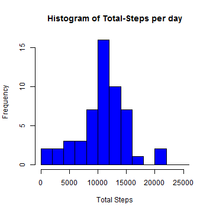
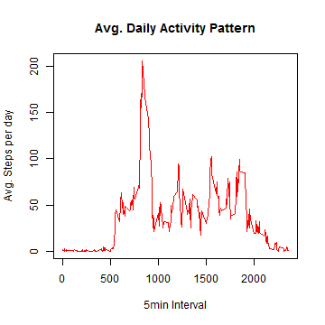
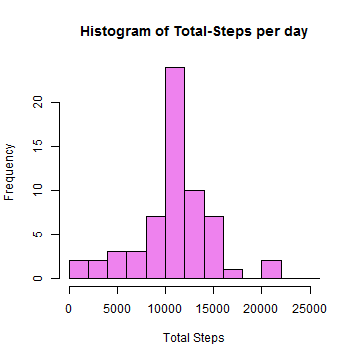
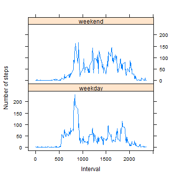

# Reproducible Research: Peer Assessment 1
by Philipp Paier

**Notes:**  
Code has been developed and tested with **R 3.1.1** on **Windows Vista**.

I used the knitr **'r-command** to present the output of code chunks embedded in the text, instead of forcing the code to print out the result. There was no indication of how to present the results in the assignment description, but I think this is the most comfortable way to read them.


## Loading and preprocessing the data
First the zip file containing the csv file is downloaded and extracted if necessary and then the data is loaded. The Date column is converted into the date format.  
**Note** that under Linux or Mac downloading might only work if the method parameter is set to 'curl'. Downloading manually and putting the zip file into the current R Working directory would also work.


```r
if(!file.exists('activity.zip'))
{
    setInternet2(use = TRUE) # necessary under windows to download files when using knitr
    download.file('https://d396qusza40orc.cloudfront.net/repdata%2Fdata%2Factivity.zip',
                  destfile='activity.zip') # add " method='curl' " if downloading fails
}

if(!file.exists('activity.csv'))
{
    unzip('activity.zip')
}
activity <- read.csv('activity.csv')
activity$date <- as.Date(activity$date, format= "%Y-%m-%d")
```

## What is mean total number of steps taken per day?

#### Histogram of total number of steps per day:

```r
stepsPerDay <- aggregate(steps ~ date, data=activity, FUN = sum)
hist(stepsPerDay$steps, col='blue',breaks=seq(0,26000,2000), 
     main = "Histogram of Total-Steps per day", xlab="Total Steps")
```

 

#### Mean and Median total number of steps per day:

```r
meanTotalSteps   <- mean(stepsPerDay$steps)
medianTotalSteps <- median(stepsPerDay$steps)
```

The **Mean** is **10766.1887** and the **Median** is **10765**

## What is the average daily activity pattern?

#### Time Series plot of the 5-minute Intervals and the avg. number of steps taken per day:

```r
intervals <- aggregate(steps ~ interval, data=activity, FUN = mean)
plot(intervals$interval, intervals$steps, type="l", 
     ylab="Avg. Steps per day", xlab="5min Interval",
     main="Avg. Daily Activity Pattern", col="red") 
```

 

#### Time Interval with the maximum number of avg. steps per day:

```r
maxIdx <- which.max(intervals$steps)
ivlMax <- intervals$interval[maxIdx]
```

The **5minute Interval** with the maximum number of steps averaged across all days is **835**

## Imputing missing values
#### Number of missing values:

```r
naIdx  <- which(is.na(activity$steps))
numNAs <- length(naIdx)
```

The **Number of missing values** is **2304**

#### Strategy and Code to impute missing values: 
for each missing value the avg. value over all days of the respective interval is used to replace the NAs:

```r
activityImp <- activity
activityImp$steps[naIdx] <- sapply(activityImp[naIdx,"interval"], 
                            function(a) {
                                idx <- which(intervals[,"interval"]==a)
                                intervals[idx,"steps"]
                            } ) 
```

#### Histogram of total number of steps per day after Imputing missing values:

```r
stepsPerDayImp <- aggregate(steps ~ date, data=activityImp, FUN = sum)
hist(stepsPerDayImp$steps, col='violet',breaks=seq(0,26000,2000), 
     main = "Histogram of Total-Steps per day", xlab="Total Steps")
```

 

#### Mean and Median total number of steps per day after Imputing missing values:

```r
meanTotalStepsImp   <- mean(stepsPerDayImp$steps)
medianTotalStepsImp <- median(stepsPerDayImp$steps)
```

The **Mean** is **10766.1887** and the **Median** is **10766.1887**. 

#### What changed?
After imputing missing values, the histogram over total number of steps per day slightly changed. The frequency of the most dominant bin (center at 11000) got higher, while the rest stayed the same. This is not surprising, when asuming that missing values occur for complete days (not depending on the interval), those days all got the same number of steps: the average number of total steps, which is in the middle of the histogram. Consequently this doesn't change the mean of the total number of steps per day. But as the mean now occurs some times in exactly the middle of the sorted vector 
of total steps per day, the median is now the same as the mean.


## Are there differences in activity patterns between weekdays and weekends?

#### Adding the Weekday feature:

```r
library(timeDate)
activityWD <- activityImp
activityWD$weekday   <- as.factor(weekdays(activityWD$date)) # not necessary, just for comparison
isw <- gsub("TRUE", "weekday", as.character(isWeekday(activityWD$date)))
activityWD$isweekday <- as.factor(gsub("FALSE", "weekend", isw))
```

#### Plotting Time intervals split on new 'isweekday' feature

```r
library(lattice)
intervalsWD <- aggregate(steps ~ interval + isweekday, data=activityWD, FUN = mean)
xyplot(steps ~ interval | isweekday, data = intervalsWD, 
       layout = c(1, 2), type = "l", 
       xlab = "Interval", ylab = "Number of steps")
```

 

#### Whats different between weekend end weekdays?
On weekends the activities are more equaly distributed, while during the week the greates peak around the interval **835** is higher. This may be the case, because on weekends people can more likely manage their time as they want, while during the week they have to work and their timeplan is more controlled. 

