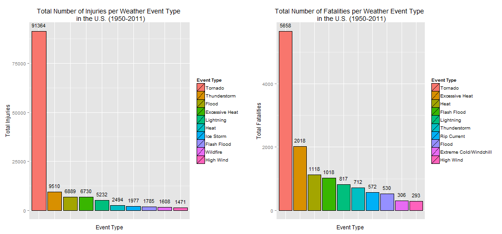
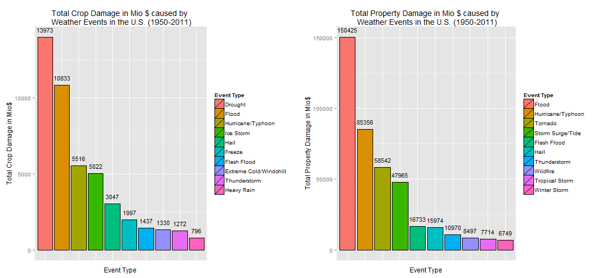

The Impact Of Weather Events On Health And Economy In The US
==========================================
by Philipp Paier (August 24, 2014)


# Synopsis
In this document an analysis is made to explore which weather events had the greatest impact on public health and economy in the United States from 1950 to 2011. Therefore the weather event dataset of the National Weather Service is processed and explored to give answers to these two questions.
The document is divided into three main chapters. The following chapter **The Data** discusses the dataset in general. The second one **Data Processing** discusses how to use R to process the data to get answers to the two questions of interest. In the chapter **Results** final results are presented and briefly discussed.

# The Data
The dataset, that is used for this analysis, comes from the National Weather Service (NWS) and can be downloaded here:
- [StormData] (https://d396qusza40orc.cloudfront.net/repdata%2Fdata%2FStormData.csv.bz2)

It holds the data of weather events since 1950 up until Nov. 2011. A detailed explanation on which features are used in this dataset and how they are generated can be found at:
- National Weather Service [Storm Data Documentation] (https://d396qusza40orc.cloudfront.net/repdata%2Fpeer2_doc%2Fpd01016005curr.pdf)
- National Climatic Data Center Storm Events [FAQ] (https://d396qusza40orc.cloudfront.net/repdata%2Fpeer2_doc%2FNCDC%20Storm%20Events-FAQ%20Page.pdf)

In this analysis we exclusively use the following features:
- **EVTYPE**: the type of the weather event (e.g. **wind**)
- **FATALITIES**: the number of fatalities caused by the event
- **INJURIES**: the number of injuries caused by the event
- **CROPDMG**: crop damage value
- **CROPDMGEXP**: crop damage exponent
- **PROPDMG**: property damage
- **PROPDMGEXP**: property damage exponent

from the **CROPDMG** and **CROPDMGEXP** and their respective property counterparts, we can derive the actual damage in dollars. This will be explained in the **Data Processing** chapter.

# Data Processing

**Notes:**  
Code has been developed and tested with **R 3.1.1** on **Windows Vista**.


## Needed R Libraries
The following R libraries are used and are therefore installed first:

```r
packages <- c("ggplot2", "R.utils", "gridExtra")
if (length(setdiff(packages, rownames(installed.packages()))) > 0) {
  install.packages(setdiff(packages, rownames(installed.packages())), 
                   repos='http://cran.us.r-project.org')  
}

library(R.utils)
```

```
## Loading required package: R.oo
## Loading required package: R.methodsS3
## R.methodsS3 v1.6.1 (2014-01-04) successfully loaded. See ?R.methodsS3 for help.
## R.oo v1.18.0 (2014-02-22) successfully loaded. See ?R.oo for help.
## 
## Attaching package: 'R.oo'
## 
## The following objects are masked from 'package:methods':
## 
##     getClasses, getMethods
## 
## The following objects are masked from 'package:base':
## 
##     attach, detach, gc, load, save
## 
## R.utils v1.32.4 (2014-05-14) successfully loaded. See ?R.utils for help.
## 
## Attaching package: 'R.utils'
## 
## The following object is masked from 'package:utils':
## 
##     timestamp
## 
## The following objects are masked from 'package:base':
## 
##     cat, commandArgs, getOption, inherits, isOpen, parse, warnings
```

```r
library(ggplot2)
library(gridExtra)
```

```
## Loading required package: grid
```

## Downloading, unzipping and loading the data

First the bz2 file containing the csv file is downloaded if necessary and then the data is loaded. 
**Note** that under Linux or Mac downloading might only work if the method parameter is set to 'curl'. Downloading manually and putting the bz2 file into the current R Working directory would also work.


```r
if(!file.exists('repdata-data-StormData.csv.bz2'))
{
    setInternet2(use = TRUE) # necessary under windows to download files when using knitr
    download.file('https://d396qusza40orc.cloudfront.net/repdata%2Fdata%2FStormData.csv.bz2',
                  destfile='repdata-data-StormData.csv.bz2') # add " method='curl' " if downloading fails
}

if(!exists("stormData"))
{
    mycols <- rep("NULL", 37); 
    mycols[c(8,23:28)] <- NA; 
    stormData <- read.csv('repdata-data-StormData.csv.bz2', colClasses=mycols)
}
```
## Basic Processing
After loading the data, we now want to address two import questions and therefore need to process the data in a certain way. First some basic processing is necessary to ensure that certain events have the same type, even when typos or other small differences in their names are present. For example we want to ensure, that the event type **Wind** is recognized as the same type as **wind**. On the other side we want to group certain events like hurricanes and typhoons, because this is suggested by the Storm Data Documentation. I therefore tried to group the events similar to what is suggested by the table on page 6 of the Storm Data Documentation. In some cases it wasn't exactly possible to determine the category of an event. In such cases I created a new category (e.g. for Ice related Events, that are no storms). Some events originally seemed to be part of one summarized group like **Waterspout/Tornado**. In such cases it depends on the order in which the following statements are evaluated if the event counts as a Tornado or a Waterspout. This is not ideal, but there is no way to find out what kind of events those really have been. One can count them to both categories as an alternative, but I decided not to, to keep the analysis simple.
 
The order in which the statements are evaluated is important. First all event types are made lowercase. Then, whenever the category of an event is replaced with a new string, this new string is capitalized. As a consequence, later grep commands won't result in another category replacement of already processed events, because they only use lower case expressions and are case sensitive. In that way each event is processed only one time and it is ensured that specific events won't falsely count towards more general categories. E.g. we don't want to count **Excessive Heat** as just **Heat**, therefore the regular expression for **excessive heat** like events is done first. Note that I also did not process all events, but only those that later turned out to have an impact on the analysis of the two questions. Events that I couldn't find a nice category for, or that are statistically irrelevant went into the category **Other**.


```r
stormDataProc <- stormData
stormDataProc$EVTYPE <- tolower(stormData$EVTYPE)
stormDataProc$EVTYPE[grepl("^avalanc" , stormDataProc$EVTYPE)] <- "Avalanche"
stormDataProc$EVTYPE[grepl("blizzard" , stormDataProc$EVTYPE)] <- "Blizzard"
stormDataProc$EVTYPE[grepl("^(coastal|beach) erosion" , stormDataProc$EVTYPE )] <- "Coastal Erosion"
stormDataProc$EVTYPE[grepl("^coastal (flood|surge)" , stormDataProc$EVTYPE )] <- "Coastal Flood"
stormDataProc$EVTYPE[grepl("^(coastal storm|coastalstorm)" , stormDataProc$EVTYPE )] <- "Coastal Storm"
stormDataProc$EVTYPE[grepl("^cold" , stormDataProc$EVTYPE )] <- "Cold/Windchill"
stormDataProc$EVTYPE[grepl("^dense smoke" , stormDataProc$EVTYPE )] <- "Dense Smoke"
stormDataProc$EVTYPE[grepl("^(drought|dry)" , stormDataProc$EVTYPE)] <- "Drought"
stormDataProc$EVTYPE[grepl("^dust devil" , stormDataProc$EVTYPE )] <- "Dust Devil"
stormDataProc$EVTYPE[grepl("^dust storm" , stormDataProc$EVTYPE )] <- "Dust Storm"
stormDataProc$EVTYPE[grepl("^blowing dust" , stormDataProc$EVTYPE )] <- "Dust Storm"
stormDataProc$EVTYPE[grepl("^(unreasonably|extreme|extended|record) (cold|windchill)" , stormDataProc$EVTYPE )] <- "Extreme Cold/Windchill"
stormDataProc$EVTYPE[grepl("^flash flood" , stormDataProc$EVTYPE )] <- "Flash Flood"
stormDataProc$EVTYPE[grepl("^(freez|frost)" , stormDataProc$EVTYPE )] <- "Freeze"
stormDataProc$EVTYPE[grepl("^(hurricane|typhoon)" , stormDataProc$EVTYPE )] <- "Hurricane/Typhoon"
stormDataProc$EVTYPE[grepl("^heat" , stormDataProc$EVTYPE )] <- "Heat"
stormDataProc$EVTYPE[grepl("^heavy (rain|shower|precipitation)" , stormDataProc$EVTYPE)] <- "Heavy Rain"
stormDataProc$EVTYPE[grepl("^(heavy|blowing) snow" , stormDataProc$EVTYPE )] <- "Heavy Snow"
stormDataProc$EVTYPE[grepl("(heavy|high|rough|rogue|hazardous) (surf|waves|seas|swells|water|wave)" , 
                           stormDataProc$EVTYPE )] <- "High Surf"
stormDataProc$EVTYPE[grepl("^high wind" , stormDataProc$EVTYPE)] <- "High Wind"
stormDataProc$EVTYPE[grepl("^(glaze|ice) storm" , stormDataProc$EVTYPE)] <- "Ice Storm"
stormDataProc$EVTYPE[grepl("^land(slide|slump|spout)" , stormDataProc$EVTYPE )] <- "Landslide"
stormDataProc$EVTYPE[grepl("^(lightning|lighting|ligntning)" , stormDataProc$EVTYPE )] <- "Lightning"
stormDataProc$EVTYPE[grepl("^marine hail" , stormDataProc$EVTYPE )] <- "Marine Hail"
stormDataProc$EVTYPE[grepl("^marine high" , stormDataProc$EVTYPE )] <- "Marine High Wind"
stormDataProc$EVTYPE[grepl("^marine strong" , stormDataProc$EVTYPE )] <- "Marine Strong Wind"
stormDataProc$EVTYPE[grepl("^marine thunder" , stormDataProc$EVTYPE )] <- "Marine Thunderstorm Wind"
stormDataProc$EVTYPE[grepl("^marine tstm" , stormDataProc$EVTYPE )] <- "Marine Thunderstorm Wind"
stormDataProc$EVTYPE[grepl("^marine" , stormDataProc$EVTYPE )] <- "Marine Other"
stormDataProc$EVTYPE[grepl("^(mudslide|mud slide)" , stormDataProc$EVTYPE )] <- "Mudslide"
stormDataProc$EVTYPE[grepl("^rip current" , stormDataProc$EVTYPE)] <- "Rip Current"
stormDataProc$EVTYPE[grepl("^seiche" , stormDataProc$EVTYPE)] <- "Seiche"
stormDataProc$EVTYPE[grepl("^sleet" , stormDataProc$EVTYPE)] <- "Sleet"
stormDataProc$EVTYPE[grepl("^storm surge" , stormDataProc$EVTYPE)] <- "Storm Surge/Tide"
stormDataProc$EVTYPE[grepl("^strong wind" , stormDataProc$EVTYPE)] <- "Strong Wind"
stormDataProc$EVTYPE[grepl("^thunder" , stormDataProc$EVTYPE )] <- "Thunderstorm"
stormDataProc$EVTYPE[grepl("^(tornado|torndao|gustnado)" , stormDataProc$EVTYPE )] <- "Tornado"
stormDataProc$EVTYPE[grepl("^tropical storm" , stormDataProc$EVTYPE )] <- "Tropical Storm"
stormDataProc$EVTYPE[grepl("^tropical depression" , stormDataProc$EVTYPE )] <- "Tropical Depression"
stormDataProc$EVTYPE[grepl("^tsunami" , stormDataProc$EVTYPE )] <- "Tsunami"
stormDataProc$EVTYPE[grepl("^(typhoon)" , stormDataProc$EVTYPE )] <- "Typhoon"
stormDataProc$EVTYPE[grepl("^(waterspout)" , stormDataProc$EVTYPE )] <- "Waterspout"
stormDataProc$EVTYPE[grepl("^volcanic ash" , stormDataProc$EVTYPE )] <- "Volcanic Ash"
stormDataProc$EVTYPE[grepl("^(wild)" , stormDataProc$EVTYPE )] <- "Wildfire"
stormDataProc$EVTYPE[grepl("^(brush|grust|forest|grass) fire" , stormDataProc$EVTYPE )] <- "Wildfire"
stormDataProc$EVTYPE[grepl("^winter storm" , stormDataProc$EVTYPE )] <- "Winter Storm"
stormDataProc$EVTYPE[grepl("^(winter weather|wintry)" , stormDataProc$EVTYPE )] <- "Winter Weather"

stormDataProc$EVTYPE[grepl("thunderstorm" , stormDataProc$EVTYPE )] <- "Thunderstorm"
stormDataProc$EVTYPE[grepl("tstm" , stormDataProc$EVTYPE )] <- "Thunderstorm"
stormDataProc$EVTYPE[grepl("warm" , stormDataProc$EVTYPE )] <- "Warm Weather"
stormDataProc$EVTYPE[grepl("(cold|low temperature)" , stormDataProc$EVTYPE )] <- "Cold/Windchill"
stormDataProc$EVTYPE[grepl("cool and wet" , stormDataProc$EVTYPE )] <- "Cold/Windchill"
stormDataProc$EVTYPE[grepl("wind" , stormDataProc$EVTYPE )] <- "Wind"
stormDataProc$EVTYPE[grepl("(ice|icy|glaze)" , stormDataProc$EVTYPE)] <- "Ice"
stormDataProc$EVTYPE[grepl("hail" , stormDataProc$EVTYPE )] <- "Hail"
stormDataProc$EVTYPE[grepl("fog" , stormDataProc$EVTYPE)] <- "Fog"
stormDataProc$EVTYPE[grepl("funnel cloud" , stormDataProc$EVTYPE)] <- "Funnel Cloud"
stormDataProc$EVTYPE[grepl("flood" , stormDataProc$EVTYPE)] <- "Flood"
stormDataProc$EVTYPE[grepl("stream fld" , stormDataProc$EVTYPE)] <- "Flood"
stormDataProc$EVTYPE[grepl("rising water" , stormDataProc$EVTYPE)] <- "Flood"
stormDataProc$EVTYPE[grepl("(rain|precipitation)" , stormDataProc$EVTYPE)] <- "Rain"
stormDataProc$EVTYPE[grepl("hyp" , stormDataProc$EVTYPE)] <- "Hypothermia"
stormDataProc$EVTYPE[grepl("snow" , stormDataProc$EVTYPE)] <- "Snow"
stormDataProc$EVTYPE[grepl("(freez|frost)" , stormDataProc$EVTYPE )] <- "Freeze"
stormDataProc$EVTYPE[grepl("high tide" , stormDataProc$EVTYPE )] <- "High Tide"
stormDataProc$EVTYPE[grepl("low tide" , stormDataProc$EVTYPE )] <- "Low Tide"
stormDataProc$EVTYPE[grepl("(unreasonably|extreme|excessive|record) (heat|warm)" , 
                           stormDataProc$EVTYPE, )] <- "Excessive Heat"

stormDataProc$EVTYPE[grepl("^([a-z]|\\?)" , stormDataProc$EVTYPE, )] <- "Other"
```


## Calculate total sums of injuries and fatalities per Event Type
To see which types of events are most harmful with respect to public health, only events that either caused injuries or fatalities are used, as others won't have any statistical impact, when summarizing. Then total sums of fatalities and injuries are calculated for each event type and ordered in decreasing manner. The results are illustrated and discussed in the chapter **Results**.

```r
# use only events that caused at least one injury and sum up the total number of injuries per event type
stormDataInjuries <- stormDataProc[stormDataProc$INJURIES!=0, c("EVTYPE","INJURIES")]
injuriesSum <- aggregate(INJURIES ~ EVTYPE, data=stormDataInjuries, FUN = sum)

# order event types and their factors in descending order by the number injuries 
injuriesSum <- injuriesSum[order(injuriesSum$INJURIES, decreasing = TRUE),]
injuriesSum$EVTYPE <- reorder(injuriesSum$EVTYPE, injuriesSum$INJURIES, function(x) {-x})

# use only events that caused at least one fatality and sum up the total number of fatalities per event type
stormDataFatalities <- stormDataProc[stormDataProc$FATALITIES!=0, c("EVTYPE","FATALITIES")]
fatalitiesSum <- aggregate(FATALITIES ~ EVTYPE, data=stormDataFatalities, FUN = sum)

# order event types and their factors in descending order by the number fatalities 
fatalitiesSum <- fatalitiesSum[order(fatalitiesSum$FATALITIES, decreasing = TRUE),]
fatalitiesSum$EVTYPE <- reorder(fatalitiesSum$EVTYPE, fatalitiesSum$FATALITIES, function(x) {-x})
```

## Calculate total sums of crop and property damage per Event Type in dollars
In order to evaluate economical damages, the crop damage value in dollars and the property damage value in dollars are calculated for each event.
This is done in the following way. The feature **CROPDMGEXP** is the exponent of the damage value, while **CROPDMG** is the factor. According to the Storm Data Documentation **CROPDMGEXP** can be either 'K' (thousand), 'M' (million) or 'B' (billlion). However, in the dataset we can also find values like 'H', numbers and special characters. I interpreted 'H' as hundred, but ignored numbers and special characters. I ignored events with numbers as exponents by setting the exponent to 0, because the numbers are overflowing digits of the neighbour column, and the real exponent is unfortunately lost. The actual damage is then given by the exponent times the factor. E.g. if **CROPDMGEXP** equals 'K' and **CROPDMG** equals '2.5' the actual crop damage value of that event is 2.500$ and is stored in the new **CROPDMGVAL** feature. For the property damage value calculations, the same procedure is used.

Lower and upper case exponents are treated as equal, and again events whose damage values are 0 (either originally or because the real exponent was lost) are filtered out.The results are illustrated and discussed in the chapter **Results**.

```r
# use only events that caused at least some property and crop damages repsectively and 
# sum up their totalnumbers
stormDataCropDmg <- stormDataProc[stormDataProc$CROPDMG!=0, c("EVTYPE","CROPDMG","CROPDMGEXP")]
stormDataPropDmg <- stormDataProc[stormDataProc$PROPDMG!=0, c("EVTYPE","PROPDMG","PROPDMGEXP")]

# map exponent characters with corresponding number for crop damages
dmgExp    <- c("h","k","m","b")
dmgExpVal <- c(100,1000,10^6,10^9)
stormDataCropDmg$CROPDMGVAL <- sapply(stormDataCropDmg$CROPDMGEXP, 
                            function(a) {
                                idx <- which(dmgExp==tolower(a))
                                if(length(idx) > 0) { dmgExpVal[idx] }
                                else 0
                            } ) 

# calculate the actual crop damage by multiplying factor with exponent
stormDataCropDmg$CROPDMGVAL <- stormDataCropDmg$CROPDMG * stormDataCropDmg$CROPDMGVAL
stormDataCropDmg <- stormDataCropDmg[stormDataCropDmg$CROPDMGVAL!=0 , c("EVTYPE","CROPDMGVAL")]

# use only events that caused at least some crop damage 
# and sum up the total number of crop damage per event type
cropDmgSum <- aggregate(CROPDMGVAL ~ EVTYPE, data=stormDataCropDmg, FUN = sum)
cropDmgSum <- cropDmgSum[order(cropDmgSum$CROPDMGVAL, decreasing = TRUE),]
cropDmgSum$EVTYPE <- reorder(cropDmgSum$EVTYPE, cropDmgSum$CROPDMGVAL, function(x) {-x})


# map exponent characters with corresponding number for property damages
stormDataPropDmg$PROPDMGVAL <- sapply(stormDataPropDmg$PROPDMGEXP, 
                            function(a) {
                                idx <- which(dmgExp==tolower(a))
                                if(length(idx) > 0) { dmgExpVal[idx] }
                                else 0
                            } ) 

# calculate the actual property damage by multiplying factor with exponent
stormDataPropDmg$PROPDMGVAL <- stormDataPropDmg$PROPDMG * stormDataPropDmg$PROPDMGVAL
stormDataPropDmg <- stormDataPropDmg[stormDataPropDmg$PROPDMGVAL!=0 , c("EVTYPE","PROPDMGVAL")]

# use only events that caused at least some property damage and 
# sum up the total number of property damage per event type
propDmgSum <- aggregate(PROPDMGVAL ~ EVTYPE, data=stormDataPropDmg, FUN = sum)
propDmgSum <- propDmgSum[order(propDmgSum$PROPDMGVAL, decreasing = TRUE),]
propDmgSum$EVTYPE <- reorder(propDmgSum$EVTYPE, propDmgSum$PROPDMGVAL, function(x) {-x})
```

# Results
As the data is now processed, we can give answers to the two questions of interest. 
## Across the United States, which types of events are most harmful with respect to population health?
To answer this question we have a look at the Top 10 events with the highest number of injuries and fatalities respectively and visualize the results using a panel plot figure, that compares those 10 events.

```r
head(injuriesSum, n=10)
```

```
##            EVTYPE INJURIES
## 39        Tornado    91364
## 38   Thunderstorm     9510
## 12          Flood     6889
## 9  Excessive Heat     6730
## 26      Lightning     5232
## 17           Heat     2494
## 24      Ice Storm     1977
## 11    Flash Flood     1785
## 44       Wildfire     1608
## 21      High Wind     1471
```

```r
head(fatalitiesSum, n=10)
```

```
##                    EVTYPE FATALITIES
## 40                Tornado       5658
## 9          Excessive Heat       2018
## 16                   Heat       1118
## 11            Flash Flood       1018
## 26              Lightning        817
## 39           Thunderstorm        712
## 34            Rip Current        572
## 12                  Flood        530
## 10 Extreme Cold/Windchill        306
## 20              High Wind        293
```

```r
# plot for total number of injuries
plotInjuries <- ggplot(data=injuriesSum[1:10,], aes(x=EVTYPE, y=INJURIES, fill=EVTYPE)) + 
    geom_bar(colour="black", stat="identity") +
    ylab(expression(paste("Total Injuries"))) + xlab("Event Type") +
    scale_fill_discrete(name="Event Type") +
    geom_text(aes(label=INJURIES), size=4, vjust=-1) +
    theme(axis.text.x = element_blank(),axis.ticks.x = element_blank()) +
    ggtitle("Total Number of Injuries per Weather Event Type \n in the U.S. (1950-2011)")


# plot for total number of fatalities
plotFatalities <- ggplot(data=fatalitiesSum[1:10,], aes(x=EVTYPE, y=FATALITIES, fill=EVTYPE)) + 
    geom_bar(colour="black", stat="identity") +
    ylab(expression(paste("Total Fatalities"))) + xlab("Event Type") +
    scale_fill_discrete(name="Event Type") +
    geom_text(aes(label=FATALITIES), size=4, vjust=-1) +
    theme(axis.text.x = element_blank(),axis.ticks.x = element_blank()) +
    ggtitle("Total Number of Fatalities per Weather Event Type \n in the U.S. (1950-2011)")

# make one figure with a panel plot out of the two plots
grid.arrange(plotInjuries, plotFatalities, ncol = 2)
```

 

The results show, that the events that cause the most injuries and fatalities are in both cases **Tornados**, followed by **Thunderstorms** with repsect to injuries and followed by **Excessive Heat** with respect to fatalities.

## Across the United States, which types of events have the greatest economic consequences?
Again we have a look at the Top 10 events in terms of property and crop damage and visualize the results with a panel plot.

```r
head(cropDmgSum, n=10)
```

```
##                    EVTYPE  CROPDMGVAL
## 4                 Drought 13972586780
## 9                   Flood 10833175050
## 16      Hurricane/Typhoon  5516117800
## 18              Ice Storm  5022113500
## 11                   Hail  3046837450
## 10                 Freeze  1997061000
## 8             Flash Flood  1437163150
## 7  Extreme Cold/Windchill  1330023000
## 27           Thunderstorm  1271658900
## 13             Heavy Rain   795752800
```

```r
head(propDmgSum, n=10)
```

```
##               EVTYPE   PROPDMGVAL
## 14             Flood 150425108300
## 25 Hurricane/Typhoon  85356410010
## 46           Tornado  58542034230
## 43  Storm Surge/Tide  47964724000
## 13       Flash Flood  16732818610
## 18              Hail  15974039220
## 45      Thunderstorm  10970410830
## 52          Wildfire   8496628500
## 48    Tropical Storm   7714390550
## 54      Winter Storm   6748997250
```

```r
# plot for total number of crop damage
plotCropDmg <- ggplot(data=cropDmgSum[1:10,], aes(x=EVTYPE, y=CROPDMGVAL/10^6, fill=EVTYPE)) + 
    geom_bar(colour="black", stat="identity") +
    ylab(expression(paste("Total Crop Damage in Mio$"))) + xlab("Event Type") +
    scale_fill_discrete(name="Event Type") +
    geom_text(aes(label=round(CROPDMGVAL/10^6)), size=4, vjust=-1) +
    theme(axis.text.x = element_blank(),axis.ticks.x = element_blank()) +
    ggtitle("Total Crop Damage in Mio $ caused by \n Weather Events in the U.S. (1950-2011)")

# plot for total number of prop damage
plotPropDmg <- ggplot(data=propDmgSum[1:10,], aes(x=EVTYPE, y=PROPDMGVAL/10^6, fill=EVTYPE)) + 
    geom_bar(colour="black", stat="identity") +
    ylab(expression(paste("Total Property Damage in Mio$"))) + xlab("Event Type") +
    scale_fill_discrete(name="Event Type") +    
    geom_text(aes(label=round(PROPDMGVAL/10^6)), size=4, vjust=-1) +
    theme(axis.text.x = element_blank(),axis.ticks.x = element_blank()) +
    ggtitle("Total Property Damage in Mio $ caused by \n Weather Events in the U.S. (1950-2011)")

# make one figure with a panel plot out of the two plots
grid.arrange(plotCropDmg, plotPropDmg, ncol = 2)
```

 

The results show, that the events that cause the most crop damages are **Drought** followed by **Flood** and **Hurricane/Typhoon**. In terms of property, **Flood** causes the most damages, followed by **Hurricane/Typhoon** and **Tornado**. 

**'**
